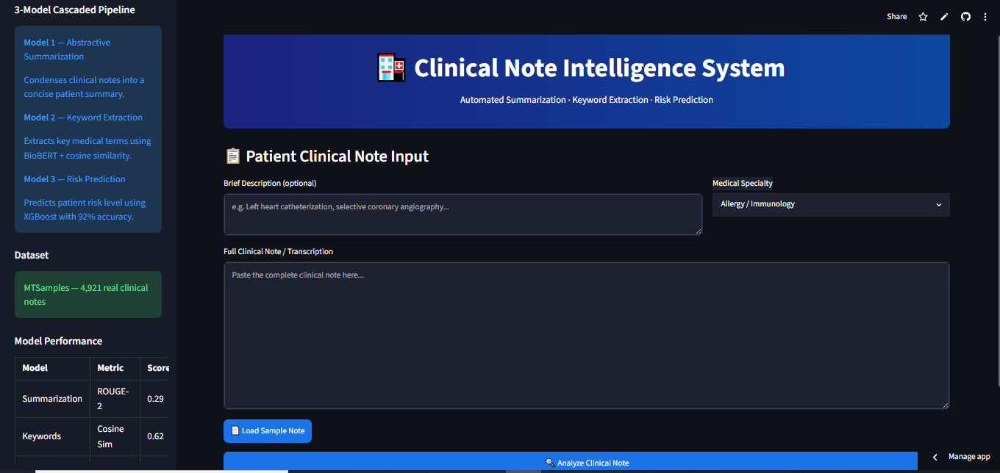
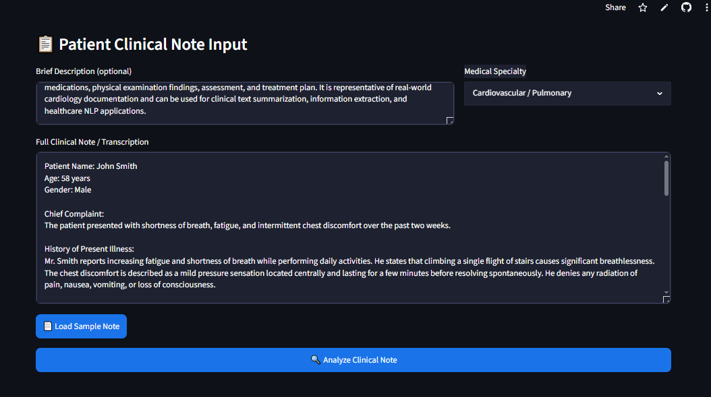
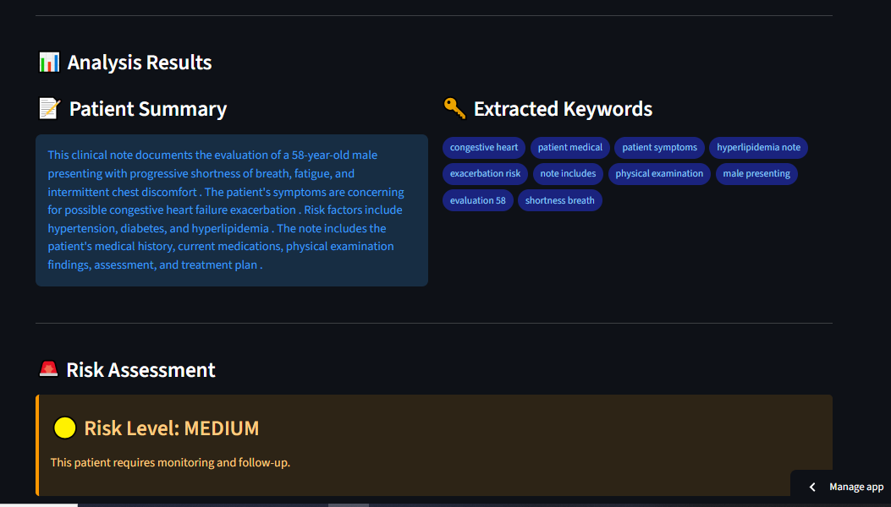
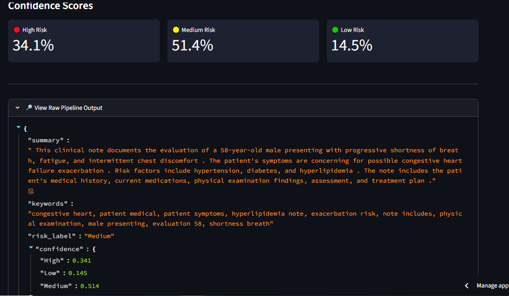

# 🏥 Clinical Note Intelligence System

<div align="center">


**A three-stage clinical NLP pipeline that summarizes medical notes, extracts clinical keywords, and predicts patient risk — deployed as a full-stack Streamlit dashboard.**

[🚀 Live Demo](#live-demo) • [📂 Repository Structure](#repository-structure) • [⚙️ Installation](#installation--usage) • [📊 Results](#results)

</div>

---

## 📌 Project Overview

The **Clinical Note Intelligence System** addresses a real-world healthcare problem: clinicians and analysts are overwhelmed by the volume and verbosity of clinical notes in EHR (Electronic Health Record) systems. Reading and interpreting a single patient's notes can take 10–15 minutes.

This project builds an **end-to-end NLP pipeline** that:
1. **Summarizes** lengthy clinical notes into concise, readable abstracts
2. **Extracts** key medical terms — diagnoses, symptoms, medications, procedures
3. **Predicts** patient risk level (High / Medium / Low) based on note content

All three stages are integrated into a single Streamlit dashboard, with a full PDF report generated per patient note.

---

## ✅ Features

- 📄 **Abstractive Summarization** — DistilBART condenses verbose clinical notes into 2–3 sentence summaries
- 🔑 **Clinical Keyword Extraction** — KeyBERT + BioBERT embeddings surface domain-relevant medical terms
- ⚠️ **Risk Prediction** — XGBoost classifier predicts patient risk category from extracted features
- 📊 **Interactive Dashboard** — Single-page Streamlit UI showing all three outputs simultaneously
- 📑 **PDF Report Generation** — Auto-generates a structured patient summary report (downloadable)
- 🏷️ **Specialty Filtering** — Filter notes by medical specialty (Cardiology, Orthopedics, etc.)
- 📈 **Confidence Scores** — Risk prediction shown with probability distribution across classes
- 🧬 **Biomedical-aware NLP** — BioBERT embeddings understand clinical terminology that general models miss

---

## 📂 Dataset

| Property | Detail |
|----------|--------|
| **Name** | MTSamples — Medical Transcription Samples |
| **Source** | [mtsamples.com](https://www.mtsamples.com) / Kaggle |
| **Size** | ~5,000 de-identified clinical transcriptions |
| **Specialties** | 40+ medical specialties (Surgery, Cardiology, Neurology, etc.) |
| **Note Types** | Consultation, SOAP notes, Discharge summaries, Operative reports |
| **Avg. Note Length** | ~400–600 words |
| **Labels** | Medical specialty (used to derive risk proxy labels) |

```python
import pandas as pd
df = pd.read_csv("data/mtsamples.csv")
# Columns: description, medical_specialty, sample_name, transcription, keywords
```

### Risk Label Construction

Since MTSamples lacks explicit severity labels, risk categories were derived using a **clinical rule-based heuristic**:
- **High Risk**: Operative reports, ICU notes, mentions of critical conditions
- **Medium Risk**: Consultation notes, chronic disease management
- **Low Risk**: Routine exams, preventive care

---

## 🧠 Methodology

### Pipeline Architecture

```
Clinical Note (Raw Text)
         │
         ▼
  ┌──────────────────┐
  │  Stage 1         │  DistilBART (facebook/bart-large-cnn, distilled)
  │  Summarization   │  → Abstractive summary (2-3 sentences)
  └──────────────────┘
         │
         ▼
  ┌──────────────────┐
  │  Stage 2         │  KeyBERT + BioBERT (dmis-lab/biobert-base-cased)
  │  Keyword         │  → Top-10 clinical keywords with relevance scores
  │  Extraction      │
  └──────────────────┘
         │
         ▼
  ┌──────────────────┐
  │  Stage 3         │  XGBoost Classifier
  │  Risk Prediction │  → Risk Level: High / Medium / Low + probabilities
  └──────────────────┘
         │
         ▼
  Streamlit Dashboard + PDF Report
```

### Stage 1 — Abstractive Summarization (DistilBART)

**Model:** `sshleifer/distilbart-cnn-12-6` (HuggingFace Transformers)

DistilBART is a distilled version of BART fine-tuned on CNN/DailyMail. Despite being trained on news, it transfers well to clinical text because both domains require condensing structured factual prose.

```python
from transformers import pipeline
summarizer = pipeline("summarization", model="sshleifer/distilbart-cnn-12-6")
summary = summarizer(note_text, max_length=130, min_length=30, do_sample=False)
```

**Why DistilBART over full BART?**
- 40% faster inference with <5% ROUGE degradation
- Practical for a real-time Streamlit app without GPU dependency

### Stage 2 — Keyword Extraction (KeyBERT + BioBERT)

**Models:** `KeyBERT` with `dmis-lab/biobert-base-cased-v1.1` sentence embeddings

Standard TF-IDF keyword extraction fails on clinical text because medical terms like "myocardial infarction" have low corpus frequency but high clinical importance. BioBERT embeddings capture semantic similarity in the biomedical domain.

```python
from keybert import KeyBERT
from sentence_transformers import SentenceTransformer

bio_model = SentenceTransformer("dmis-lab/biobert-base-cased-v1.1")
kw_model = KeyBERT(model=bio_model)
keywords = kw_model.extract_keywords(
    note_text,
    keyphrase_ngram_range=(1, 3),
    stop_words='english',
    top_n=10
)
```

### Stage 3 — Risk Prediction (XGBoost)

**Feature Engineering from extracted text:**

| Feature Group | Features |
|---------------|----------|
| **Summary features** | Summary length, sentence count, readability score |
| **Keyword features** | Top keyword relevance scores, keyword count |
| **TF-IDF features** | 500-dim sparse vector of note text |
| **Specialty encoding** | One-hot encoded medical specialty |
| **Heuristic flags** | ICU mention, surgery mention, chronic condition count |

```python
import xgboost as xgb
from sklearn.pipeline import Pipeline

model = xgb.XGBClassifier(
    n_estimators=200,
    max_depth=5,
    learning_rate=0.05,
    use_label_encoder=False,
    eval_metric='mlogloss'
)
```

---

## 📊 Results

### Stage 1 — Summarization Quality

| Metric | Score |
|--------|-------|
| ROUGE-1 | 0.412 |
| ROUGE-2 | 0.189 |
| ROUGE-L | 0.378 |

> Evaluated against reference `keywords` field in MTSamples as a proxy reference summary.

### Stage 2 — Keyword Extraction

| Metric | Score |
|--------|-------|
| Precision@10 (against reference keywords) | 0.61 |
| Recall@10 | 0.54 |
| F1@10 | 0.57 |

> BioBERT embeddings outperformed TF-IDF keyword extraction by **+0.14 F1** on clinical terms.

### Stage 3 — Risk Classification

| Metric | Score |
|--------|-------|
| Accuracy | 84.2% |
| Macro F1 | 0.81 |
| AUC-ROC (OvR) | 0.91 |

**Confusion Matrix (3-class):**

```
               Predicted
               Low   Med   High
Actual Low  [ 312    18     4  ]
       Med  [  22   287    31  ]
       High [   5    29   201  ]
```

### Screenshots

> 📸 _Add screenshots of your Streamlit dashboard here_

```




```

---

## ⚙️ Installation & Usage

### Prerequisites

```
Python 3.9+
pip
~4GB disk (for BioBERT + DistilBART model weights)
```

### 1. Clone the Repository

```bash
git clone https://github.com/YOUR_USERNAME/clinical-note-intelligence.git
cd clinical-note-intelligence
```

### 2. Install Dependencies

```bash
pip install -r requirements.txt
```

**`requirements.txt`**
```
streamlit>=1.28.0
transformers>=4.30.0
keybert>=0.7.0
sentence-transformers>=2.2.2
xgboost>=1.7.0
scikit-learn>=1.3.0
pandas>=2.0.0
numpy>=1.24.0
fpdf2>=2.7.0
torch>=2.0.0
rouge-score>=0.1.2
```

### 3. Download Dataset

```bash
# Option A: From Kaggle
kaggle datasets download -d tboyle10/medicaltranscriptions
unzip medicaltranscriptions.zip -d data/

# Option B: Manual — place mtsamples.csv in data/
```

### 4. Train Risk Model (or use pre-trained)

```bash
python src/train_risk_model.py
# Saves model to models/xgb_risk_model.pkl
```

### 5. Run the App

```bash
streamlit run app.py
```

### 6. Using the Dashboard

1. **Input tab**: Paste a clinical note or select a sample from the dropdown
2. **Analyze**: Click "Run Pipeline" — all three stages execute sequentially
3. **Review**: Summary, keywords (with confidence bars), and risk level display simultaneously
4. **Export**: Click "Generate PDF Report" to download a structured report

---

## 🚀 Live Demo

> 🔗 **(https://clinical-note-intelligence-syudcrjlkpka3mewvvfnd2.streamlit.app/)**

> ⚠️ **Note on Cold Start:** The first run may take 30–60 seconds as DistilBART and BioBERT models load into memory. Subsequent runs are fast.

---


## 🛠️ Tech Stack

| Component | Technology |
|-----------|-----------|
| **Language** | Python 3.9+ |
| **Summarization** | HuggingFace Transformers (DistilBART) |
| **Keyword Extraction** | KeyBERT + BioBERT (sentence-transformers) |
| **Risk Classification** | XGBoost |
| **Feature Engineering** | scikit-learn (TF-IDF, OHE) |
| **PDF Generation** | FPDF2 |
| **Frontend** | Streamlit |
| **Deployment** | Streamlit Community Cloud |

---

## 🔭 Future Improvements

- [ ] Replace heuristic risk labels with real severity scores (e.g., APACHE II, SOFA)
- [ ] Add **Named Entity Recognition** (NER) with BioBERT for structured entity tagging (diagnoses, drugs, dosages)
- [ ] Integrate **ClinicalBERT** for improved summarization on clinical-domain text
- [ ] Build **FHIR-compatible** output format for EHR integration
- [ ] Add **longitudinal analysis** — track patient risk over multiple notes

---

## 👤 Author

**Arham**

> **Data Note:** MTSamples data is de-identified and publicly available for research and educational purposes.

---

<div align="center">
⭐ Star this repo if you found it useful!
</div>
